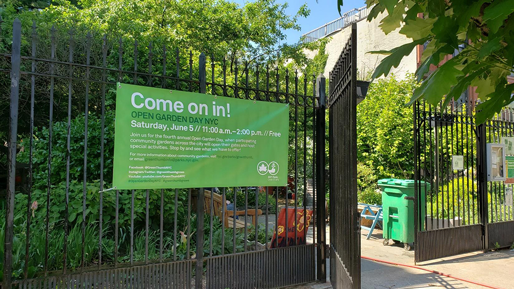
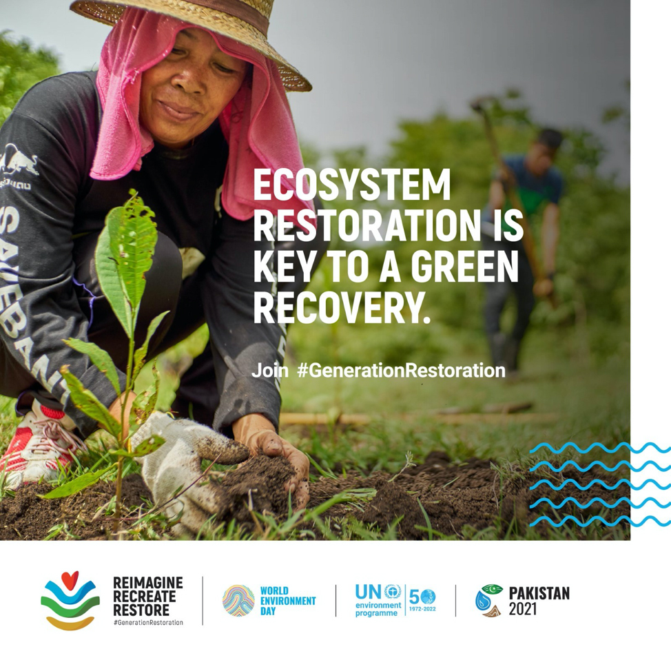
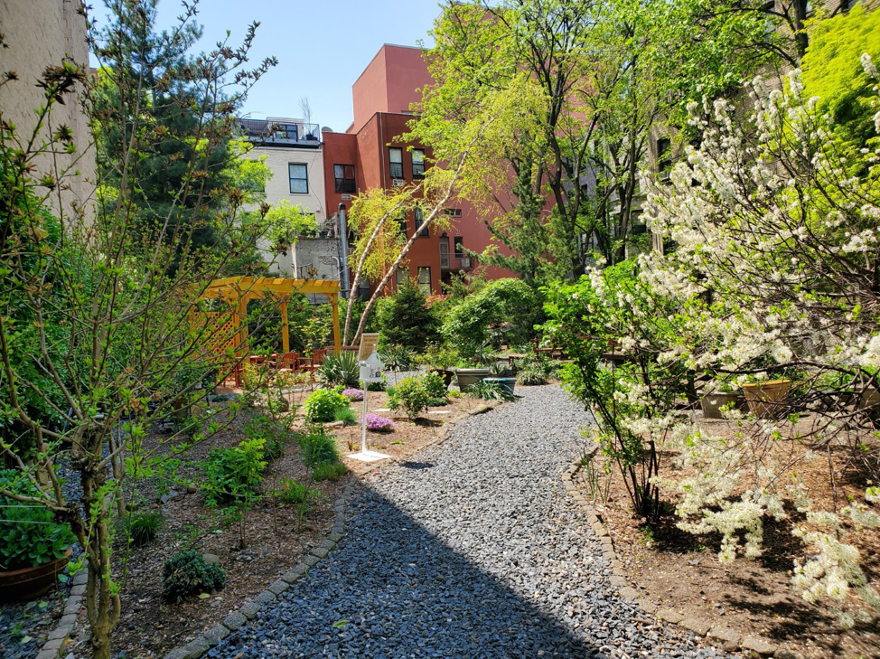
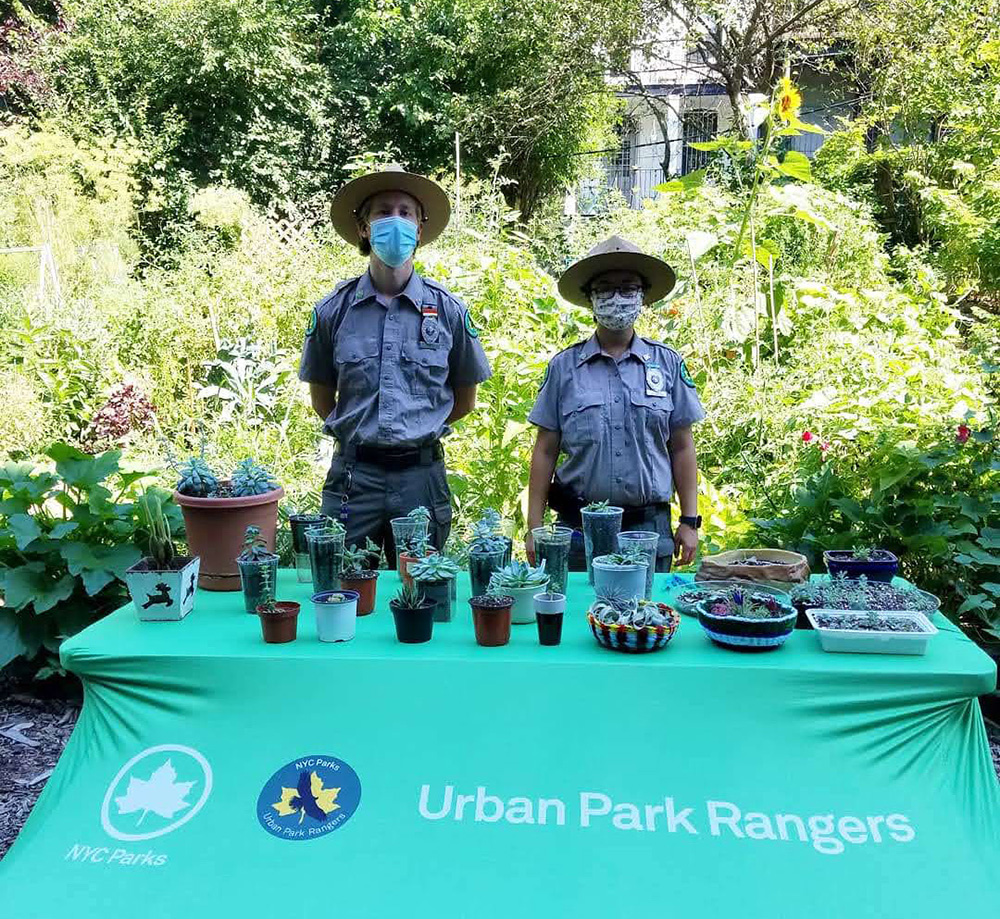
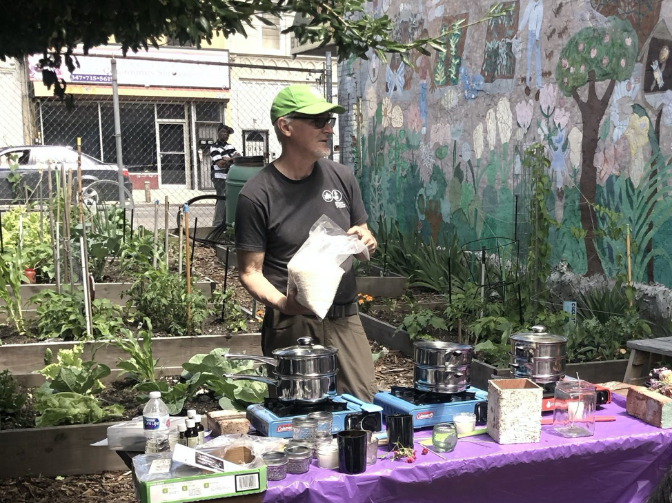

### Open Garden Day NYC

**For scheduling updates on this year's Open Garden Day NYC, please visit our[website](https://newsletters.nycgovparks.org/lt.php?c=67118&m=67891&nl=14&s=6af344c6e0a25be16a9ce233bb3371bb&lid=3564226&l=-https--greenthumb.nycgovparks.org/news.html--Q-news_id--E-498).**

  

Prospect Heights Community Farm in Brooklyn  
Photo by Victor Polanco and Harold Paynter, GreenThumb\[/caption\]  

  
Open Garden Day NYC

Saturday, June 5, 2021[11:00 a.m. – 2:00 p.m.](x-apple-data-detectors://6)_rain or shine_

NYC Parks GreenThumb will be hosting the[fourth annual Open Garden Day NYC](https://newsletters.nycgovparks.org/lt.php?c=67118&m=67891&nl=14&s=6af344c6e0a25be16a9ce233bb3371bb&lid=3564226&l=-https--greenthumb.nycgovparks.org/news.html--Q-news_id--E-498)**[on Saturday, June 5th from 11:00 a.m. – 2:00 p.m.](x-apple-data-detectors://7)**_(rain or shine)_. Join us for this special day when community gardens across the city will open their gates to the public on the same day and time with free activities for all to enjoy! There will be more than 70 gardens participating and offering garden tours, workshops on plants, flowers, and composting, music, arts and crafts, yoga, opportunities to paint, listen to music, and garden, and much more! To see where the gardens are located, visit the[Open Garden Day 2021 Map](https://newsletters.nycgovparks.org/lt.php?c=67118&m=67891&nl=14&s=6af344c6e0a25be16a9ce233bb3371bb&lid=3564227&l=-https--www.google.com/maps/d/u/0/viewer--Q-mid--E-1hu8GQ0q7i34dW8Az34atVNdyFbSk3o1k--A-ll--E-40.73082408070964%2C-73.94902085000001--A-z--E-11).  

### Activities Led by GreenThumb

We are partnering with the[United Nations Environment Programme](https://newsletters.nycgovparks.org/lt.php?c=67118&m=67891&nl=14&s=6af344c6e0a25be16a9ce233bb3371bb&lid=3564228&l=-https--www.unep.org/)to celebrate[World Environment Day](https://newsletters.nycgovparks.org/lt.php?c=67118&m=67891&nl=14&s=6af344c6e0a25be16a9ce233bb3371bb&lid=3564229&l=-https--www.worldenvironmentday.global/)who has declared the years**2021-2030**the_Decade of Ecosystem Restoration_.**World Environment Day**is celebrated every year on**June 5**to raise awareness and generate action on a pressing environmental issue. The Day offers an opportunity to reflect on accomplishments and renew our resolve in overcoming the environmental challenges facing the world today. Join representatives from the United Nations, including Ligia Noronha (UN Assistant Secretary-General and Head of UNEP, New York Office) for a gardener-led tour in the East Village of[La Plaza Cultural de Armando Perez Community Garden](https://newsletters.nycgovparks.org/lt.php?c=67118&m=67891&nl=14&s=6af344c6e0a25be16a9ce233bb3371bb&lid=3564230&l=-http--laplazacultural.com/)and[9th Street Community Garden & Park](https://newsletters.nycgovparks.org/lt.php?c=67118&m=67891&nl=14&s=6af344c6e0a25be16a9ce233bb3371bb&lid=3564231&l=-https--www.facebook.com/9thstreetcommunitygardenpark/)[on](x-apple-data-detectors://11)  
**[Saturday, June 5th at 11:00 a.m.](x-apple-data-detectors://11)**

Harlem Rose Garden, one of the stops on the Harlem Community Garden Bike Tour. Photo by K.C. Alvey, GreenThumb

**[Saturday, June 5, 12:00 p.m. - 3:00 p.m.](x-apple-data-detectors://13)**[**Harlem Community Garden Bike Tour**](https://newsletters.nycgovparks.org/lt.php?c=67118&m=67891&nl=14&s=6af344c6e0a25be16a9ce233bb3371bb&lid=3564232&l=-https--www.eventbrite.com/e/harlem-community-garden-bike-tour-tickets-149717187137)

This historic Harlem bike tour explores the neighborhood's rich community garden legacy. Along the ride, participants will see diverse food production practices honoring Black southern roots, horticultural beacons, and outdoor educational spaces that are woven into fabric of Central Harlem.

Please[RSVP on Eventbrite](https://newsletters.nycgovparks.org/lt.php?c=67118&m=67891&nl=14&s=6af344c6e0a25be16a9ce233bb3371bb&lid=3564232&l=-https--www.eventbrite.com/e/harlem-community-garden-bike-tour-tickets-149717187137)._Space is limited and registration is required._**\* Sold Out**

[NYC Parks GreenThumb](https://newsletters.nycgovparks.org/lt.php?c=67118&m=67891&nl=14&s=6af344c6e0a25be16a9ce233bb3371bb&lid=3564233&l=-https--greenthumb.nycgovparks.org/)partnered with[NYC Department of Transportation](https://newsletters.nycgovparks.org/lt.php?c=67118&m=67891&nl=14&s=6af344c6e0a25be16a9ce233bb3371bb&lid=3564234&l=-https--www1.nyc.gov/html/dot/html/home/home.shtml)(DOT) to celebrate[Bike Month](https://newsletters.nycgovparks.org/lt.php?c=67118&m=67891&nl=14&s=6af344c6e0a25be16a9ce233bb3371bb&lid=3564235&l=-https--www.bikemonth.nyc/)in May with a series of socially distanced[community garden bike tours](https://newsletters.nycgovparks.org/lt.php?c=67118&m=67891&nl=14&s=6af344c6e0a25be16a9ce233bb3371bb&lid=3564236&l=-https--greenthumb.nycgovparks.org/news.html--Q-news_id--E-500)along with the release of a number of self-guided bike tour maps. Download a bike tour map of community gardens in the South Bronx and Eastern Brooklyn on our website[here](https://newsletters.nycgovparks.org/lt.php?c=67118&m=67891&nl=14&s=6af344c6e0a25be16a9ce233bb3371bb&lid=3564236&l=-https--greenthumb.nycgovparks.org/news.html--Q-news_id--E-500)and[DOT's website](http://www1.nyc.gov/html/dot/html/bicyclists/bikemaps.shtml#guidedrides). Bike tours of community gardens in Harlem, Western Queens, and Upper Manhattan will be available soon.

Each community garden has its own unique story shaped by its community through time.[Tea Arts & Culture](https://newsletters.nycgovparks.org/lt.php?c=67118&m=67891&nl=14&s=6af344c6e0a25be16a9ce233bb3371bb&lid=3564237&l=-https--teaartsculture.org/spring-tea-2021)invite you to the GreenThumb community gardens on[Open Garden Day NYC](https://newsletters.nycgovparks.org/lt.php?c=67118&m=67891&nl=14&s=6af344c6e0a25be16a9ce233bb3371bb&lid=3564226&l=-https--greenthumb.nycgovparks.org/news.html--Q-news_id--E-498)to take a journey with us this spring, learn more about these vital green spaces, the communities and stories near us and safely reconnect through tea and arts.

Bring your own tea. These events are FREE.[Registration is required](https://newsletters.nycgovparks.org/lt.php?c=67118&m=67891&nl=14&s=6af344c6e0a25be16a9ce233bb3371bb&lid=3564238&l=-https--teaartsculture.org/nature-tea).

• La Finca Del Sur Community Garden  
110 East 138th Street,**[11:00 a.m. - 1:00 p.m.](x-apple-data-detectors://15)**  
Learn from an Ikebana presentation by[Paula Tam](https://newsletters.nycgovparks.org/lt.php?c=67118&m=67891&nl=14&s=6af344c6e0a25be16a9ce233bb3371bb&lid=3564239&l=-https--ikebananyc.org/)and share some quiet tea time with Janelle Galvez.  
[RSVP on the Tea Arts & Culture website](https://newsletters.nycgovparks.org/lt.php?c=67118&m=67891&nl=14&s=6af344c6e0a25be16a9ce233bb3371bb&lid=3564240&l=-https--teaartsculture.org/nature-tea/springtea2021-southbronx)

• East Side Outside Community Garden  
[415 East 11th Street](x-apple-data-detectors://16),**[2:00 p.m. - 4:00 p.m.](x-apple-data-detectors://17)**  
Learn from an Ikebana presentation by[Kristina Bajunaishvili](https://newsletters.nycgovparks.org/lt.php?c=67118&m=67891&nl=14&s=6af344c6e0a25be16a9ce233bb3371bb&lid=3564241&l=-https--www.instagram.com/umekado/)and enjoy live music by[Testu Collective](https://newsletters.nycgovparks.org/lt.php?c=67118&m=67891&nl=14&s=6af344c6e0a25be16a9ce233bb3371bb&lid=3564242&l=-https--www.testucollective.com/),[insomniac hotel](https://newsletters.nycgovparks.org/lt.php?c=67118&m=67891&nl=14&s=6af344c6e0a25be16a9ce233bb3371bb&lid=3564243&l=-https--www.instagram.com/insomniachotel/--Q-hl--E-en), and[Maria Takeuchi](https://newsletters.nycgovparks.org/lt.php?c=67118&m=67891&nl=14&s=6af344c6e0a25be16a9ce233bb3371bb&lid=3564244&l=-https--www.instagram.com/emuaudiovisual/--Q-hl--E-en).[RSVP on the Tea Arts & Culture website](https://newsletters.nycgovparks.org/lt.php?c=67118&m=67891&nl=14&s=6af344c6e0a25be16a9ce233bb3371bb&lid=3564245&l=-https--teaartsculture.org/nature-tea/spring-tea-2021)**\* Sold Out**

• Hill Street Community Garden  
[50 Hill Street](x-apple-data-detectors://18),**[3:30 p.m. - 5:30 p.m.](x-apple-data-detectors://19)**  
Embrace the music from[The Brooklyn Nomad](https://newsletters.nycgovparks.org/lt.php?c=67118&m=67891&nl=14&s=6af344c6e0a25be16a9ce233bb3371bb&lid=3564246&l=-https--www.thebrooklynnomads.com/)by Hadi Eldebek and Mohamad Eldebek and have an interactive conversation with the musicians. Share time for a guided tea meditation and story sharing conversation with[Erika Houle](https://newsletters.nycgovparks.org/lt.php?c=67118&m=67891&nl=14&s=6af344c6e0a25be16a9ce233bb3371bb&lid=3564247&l=-https--www.steepingfilms.com/)to connect to yourself, nature, and each other. Enjoy a tour of the garden to learn about the plants and herbs growing in the community garden with[Imrana Sayed](https://newsletters.nycgovparks.org/lt.php?c=67118&m=67891&nl=14&s=6af344c6e0a25be16a9ce233bb3371bb&lid=3564248&l=-https--www.instagram.com/imrana.sayed/).  
[RSVP on the Tea Arts & Culture website](https://newsletters.nycgovparks.org/lt.php?c=67118&m=67891&nl=14&s=6af344c6e0a25be16a9ce233bb3371bb&lid=3564249&l=-https--teaartsculture.org/nature-tea/spring-tea-2021-sel8x)

Urban Park Rangers giving a a succulent workshop during last year's Open Garden Day NYC at Brooklyn Bears Carlton Avenue Garden. Photo by Genea Foster

The**Urban Park Rangers**will lead composting workshops during Open Garden Day NYC at[Red Shed Community Garden](https://newsletters.nycgovparks.org/lt.php?c=67118&m=67891&nl=14&s=6af344c6e0a25be16a9ce233bb3371bb&lid=3564250&l=-https--www.instagram.com/redshedcommunitygarden/--Q-hl--E-en)in Brooklyn and[H.E.A.L.T.H for Youths Skyline Garden](https://newsletters.nycgovparks.org/lt.php?c=67118&m=67891&nl=14&s=6af344c6e0a25be16a9ce233bb3371bb&lid=3564251&l=-https--www.instagram.com/health4youths_skyline_garden/--Q-hl--E-en)in Staten Island. For more details, please visit our[website](https://newsletters.nycgovparks.org/lt.php?c=67118&m=67891&nl=14&s=6af344c6e0a25be16a9ce233bb3371bb&lid=3564226&l=-https--greenthumb.nycgovparks.org/news.html--Q-news_id--E-498).

  
A candle making workshop in 2019 led by Bill Pape at Georgia Avenue Community Garden in Brooklyn. Photo by Elena Dubas, GreenThumb

Learn how to create natural insect repellent candles from GreenThumb Outreach Coordinator, Bill Pape, in a workshop at**Success Garden**, located at[449-461 Williams Avenue in East New York](x-apple-data-detectors://20), Brooklyn,[from Noon – 1:30 p.m.](x-apple-data-detectors://21)  
_Materials will be provided, but supplies are limited_.

We will share news and updates on scheduled programming on our social media pages:[@greenthumbgrows on Instagram](https://newsletters.nycgovparks.org/lt.php?c=67118&m=67891&nl=14&s=6af344c6e0a25be16a9ce233bb3371bb&lid=3564252&l=-https--www.instagram.com/greenthumbgrows/)/[Twitter](https://newsletters.nycgovparks.org/lt.php?c=67118&m=67891&nl=14&s=6af344c6e0a25be16a9ce233bb3371bb&lid=3564253&l=-https--twitter.com/greenthumbgrows)and[Facebook (@GreenThumbNYC)](https://newsletters.nycgovparks.org/lt.php?c=67118&m=67891&nl=14&s=6af344c6e0a25be16a9ce233bb3371bb&lid=3564254&l=-https--www.facebook.com/GreenThumbNYC/)leading up to Open Garden Day on June 5th.

\* _Schedule subject to change_  

### Follow GreenThumb on Social Media!

If you or your Community Garden are on social media, follow[@greenthumbgrows on Instagram](https://newsletters.nycgovparks.org/lt.php?c=67118&m=67891&nl=14&s=6af344c6e0a25be16a9ce233bb3371bb&lid=3564252&l=-https--www.instagram.com/greenthumbgrows/)and[Twitter](https://newsletters.nycgovparks.org/lt.php?c=67118&m=67891&nl=14&s=6af344c6e0a25be16a9ce233bb3371bb&lid=3564253&l=-https--twitter.com/greenthumbgrows), and[@GreenThumbNYC on Facebook](https://newsletters.nycgovparks.org/lt.php?c=67118&m=67891&nl=14&s=6af344c6e0a25be16a9ce233bb3371bb&lid=3564254&l=-https--www.facebook.com/GreenThumbNYC/), to find out about the latest workshops, events, and news at GreenThumb.
